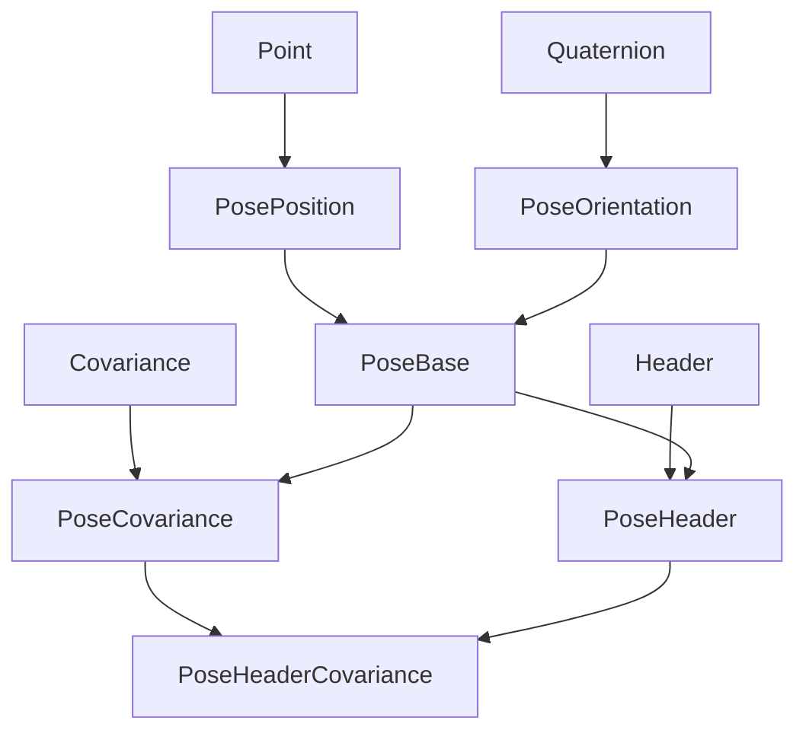

# adx_data
This project implements a set of custom data types that can replace ROS data types. The goal is independence from ROS and support with external libraries, one over all [Eigen](https://eigen.tuxfamily.org/index.php?title=Main_Page). Linear algebra is the basis of robotics, so being able to use a library like Eigen ensures ease of use and optimization in case of matrix operations.

## Dependencies

* [roscomp](https://git.hipert.unimore.it/adx/utils/ros_compatibility)
* Eigen

## Implemented data type

### Vector
Representation of a vector defined using `Eigen::Matrix<Type, Size, 1>`.

#### Constructor
* Construct a new Vector object from a ROS Point message `roscomp::geometry_msgs::Point`
* Construct a new Vector object from a pointer to ROS Point message `roscomp::CallbackPtr<roscomp::geometry_msgs::Point>`
* Construct a new Vector object from a ROS Vector3 message with values to copy `roscomp::CallbackPtr<roscomp::geometry_msgs::Vector3>`

### Point

This contains the position of a point in free space.

#### Constructors

* a ROS Point message `roscomp::geometry_msgs::Point`
* a pointer to a ROS Point message `roscomp::CallbackPtr<roscomp::geometry_msgs::Point>`

----

### TimeStamp
Generic data header with timestamp and frame_id. This header stores a timestamp of the received data and a frame_id to identify in which set of coordinates a specific message resides. An exact representation of time, stored as a `chrono::time_point`.

#### Constructors

* a ROS time class, this constructor initializes the timestampg using the values from a ROS time.

----

### Header
This header stores a timestamp of the received data and a frame_id to identify in which set of coordinates a specific message resides.

#### Constructors

* a ROS header message `roscomp::std_msgs::Header`
* a pointer to a ROS header message `roscomp::CallbackPtr<roscomp::std_msgs::Header>`

----

### Quaternion

This represents an orientation in free space in quaternion form. In this case, the data type inherits from the Quaternion data type defined by eigen `Eigen::Quaternion<Type>`.

#### Constructors

* a ROS Quaternion message `roscomp::geometry_msgs::Quaternion`
* a pointer to a ROS Quaternion message `roscomp::CallbackPtr< roscomp::geometry_msgs::Quaternion>`

----

### Covariance
Size x Size covariance matrix. Size is the number of values that may be correlated, using an Eigen matrix as the underlying data type. The struct inherits from eigen matrix `Eigen::Matrix<Type, Size, Size>`.

#### Constructors

* a ROS covariance which is a row-major std::array of Size * Size length `std::array<ArrayType, Size * Size>`

----

### PosePosition
A representation of pose in free space, composed of position and orientation. PosePosition inherits from Point.

----

### PoseOrentation
The orientation part of the Pose is defined by `Quaternion`

#### Constructors

* Construct a new PoseOrientation object from a ROS Pose message `roscomp::geometry_msgs::Quaternion`
* Construct a new PoseOrientation object from a pointer to ROS Pose message `roscomp::CallbackPtr<roscomp::geometry_msgs::Quaternion>`.

----

### PoseBase
PosePosition inherits from PosePosition and PoseOrentation. The copy constructor of the inherited structure is used to construct a new PoseBase object.

----

### PoseHeader
PoseHeader inherits form PoseBase and Header.The template that defines the data type takes as input a boolean hasHeader that defines whether to create the PoseHeader with or without a header.

#### Constructors

* Construct a new PoseHeader object from a ROS PoseWithCovarianceStamped message `roscomp::geometry_msgs::PoseWithCovarianceStamped`

----

### PoseCovariance
PoseCovariance inherits form PoseBase. PoseCovariance is defined by a PoseBase and a Covariance.The template that defines the data type takes as input a boolean hasCovariance that defines whether to create the PoseCovariance with or without a covariance.

#### Constructors

* Construct a new PoseCovariance object from a ROS PoseWithCovariance message `roscomp::geometry_msgs::PoseWithCovariance`

* Construct a new PoseCovariance object from a pointer to ROS PoseWithCovariance message `roscomp::CallbackPtr<roscomp::geometry_msgs::PoseWithCovariance>`

----

### PoseHeaderCovariance
PoseHeaderCovariance inherits form PoseBase, PoseHeader and PoseCovariance.

#### Constructors

* Construct a new PoseHeaderCovariance object from a ROS PoseStamped message `roscomp::geometry_msgs::PoseWithCovarianceStamped`

* Construct a new PoseHeaderCovariance object from a pointer to ROS PoseStamped message `roscomp::CallbackPtr<roscomp::geometry_msgs::PoseWithCovarianceStamped>`

----

### Twist
This represents velocity in free space broken into its linear and angular components. The twist is defined by two `adx::data::Vector3d` representing the linear velocity component and the angular velocity and one `Covarianced<6>` in order there should be x-linear, y-linear, z-linear, x-angular, y-angular, z-angular.

#### Constructors

* Construct a new Twist object from a ROS Twist message `roscomp::geometry_msgs::Twist`.
* Construct a new Twist object from a pointer to ROS Twist message `roscomp::CallbackPtr<roscomp::geometry_msgs::Twist>`.
* Construct a new Twist object from a ROS TwistWithCovariance message `roscomp::geometry_msgs::TwistWithCovariance`
* Construct a new Twist object from a pointer to ROS TwistWithCovariance message `roscomp::CallbackPtr<roscomp::geometry_msgs::TwistWithCovariance>`

---

### Particle

A weighted estimate of robot pose, pose represents the estimated position and orientation of the robot.
Weight represents the estimated weight of this particle. This data type is derived from Pose and Weight.

#### Constructors

* Use only the default constructor, then use the inherited constructors

---

### Odometry

Odometry is an estimate of a position and velocity in free space. Pose represents the estimated position and orientation of the robot. Twist represents the estimated velocities of the robot. The odometry data type inherits from Header, Pose3d and Twist.

#### Constructors

* Construct a new Odometry object from a ROS Odometry message `roscomp::nav_msgs::Odometry`
* Construct a new Odometry object from a pointer to ROS Odometry message `roscomp::CallbackPtr<roscomp::nav_msgs::Odometry>`

---

### Obstacle

This struct represents a cube obstacle. The obstacle data type inherits from Pose and Twist. The cube half-lenghts, the linear combination of position and size gives us the cube vertices for this I define an `adx::data::Vector3d`.

#### Constructors

* Construct a new Obstacle object from a ROS obstacle message `roscomp::adx_msgs::Obstacle`
* Construct a new Obstacle object from a pointer to ROS obstacle message `roscomp::CallbackPtr<roscomp::adx_msgs::Obstacle>`

---

### Plan

This is essentially just an Path that uses Point instead of Pose and stores a reference speed for each point This is useful in racing environments. The plane data type inherits from header. For the positions are used a series of points that are used to represent the path `std::vector<Point3d>`. Speeds are represented by a series of adx Vector3d `std::vector<adx::data::Vector3d>`.

#### Costructors

* Construct a new Plan object from a ROS Plan message `roscomp::adx_msgs::Plan`
* Construct a new Plan object from a pointer to ROS Plan message `roscomp::CallbackPtr<roscomp::adx_msgs::Plan>`

---

### Path

A series of Pose representing a Path for robot navigation. The path data type inherits from header. For the rappresentation of the path are used a series of poses `std::vector<Pose<double, 3, false, false>>`.

#### Constructors

* Construct a new Path object from a ROS Path message `roscomp::nav_msgs::Path`
* Construct a new Path object from a pointer to ROS Path message `roscomp::CallbackPtr<roscomp::nav_msgs::Path>`
* Construct a new Path object from a ROS Plan message `roscomp::adx_msgs::Plan`
* Construct a new Path object from a pointer to ROS Plan message `roscomp::CallbackPtr<roscomp::adx_msgs::Plan>`

## Authors
* **Michele Guzzinati** - [mguzzina](https://github.com/mguzzina)
* **Federico Gavioli** - [fgavioli](https://github.com/fgavioli)
* **Andrea Bernardi** - [andreabernard](https://github.com/andreabernard)
* **Antonio Russo** - [russoanto](https://github.com/russoanto)

## Project Managers
* **Paolo Burgio** - [pburgio](https://github.com/pburgio)

## License
**Apache 2.0** - [License](https://opensource.org/licenses/Apache-2.0)

## AD Project
This repository is part of the autonomous driving project of the University of Modena and Reggio Emilia, [read more](https://hipert.github.io/ad_site/).